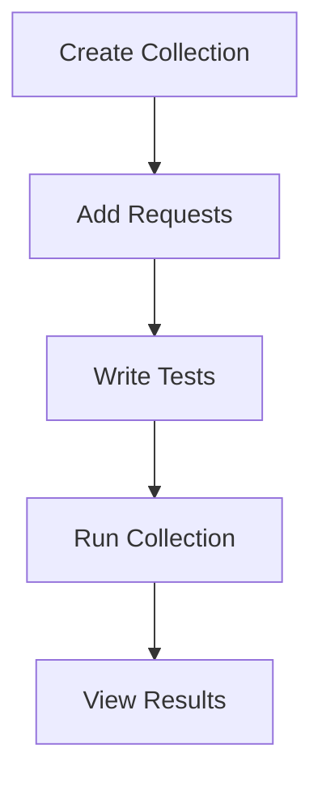

## Postman Testing  

Postman is one of the most widely used tools for API testing, offering a **user-friendly interface** and powerful automation capabilities.  
This section focuses on **how testers use Postman effectively**, from manual testing to CI/CD integration.

---

### **Why Postman?**

- **Ease of Use**: No coding required for basic tests.
- **Automation Support**: Collections and scripts for advanced workflows.
- **Collaboration**: Shareable collections and environments.
- **CI/CD Integration**: Run tests in pipelines using Newman.

##### **Tester Rule**
> Use Postman for quick validations and exploratory testing, but automate repetitive tasks using scripts and collections.

---

### **Key Features of Postman**

#### **1️⃣ Requests and Responses**
- Create and send HTTP requests (GET, POST, PUT, DELETE, etc.).
- View response headers, body, and status codes.

##### **Example**
Testing a `GET` request:
```http
GET https://api.example.com/users
```

---

#### **2️⃣ Environments**
- Store variables like base URLs, tokens, and credentials.
- Switch between environments (e.g., dev, staging, prod).

##### **Code Snippet: Using Environment Variables**
```javascript
// Access environment variable
pm.environment.get("base_url");

// Set environment variable
pm.environment.set("token", "abc123");
```

---

#### **3️⃣ Tests and Assertions**
- Write JavaScript-based tests to validate responses.
- Common assertions include status codes, response body fields, and headers.

##### **Code Snippet: Writing Tests**
```javascript
// Validate status code
pm.test("Status code is 200", function () {
    pm.response.to.have.status(200);
});

// Validate response body
pm.test("Response has correct name", function () {
    const response = pm.response.json();
    pm.expect(response.name).to.eql("John");
});
```

---

#### **4️⃣ Pre-request Scripts**
- Execute scripts before sending a request (e.g., generate tokens, set headers).

##### **Code Snippet: Generating a Token**
```javascript
// Generate a token and set it as a header
const token = "abc123";
pm.request.headers.add({ key: "Authorization", value: `Bearer ${token}` });
```

---

#### **5️⃣ Collections**
- Group related requests into collections.
- Run collections as test suites.

##### **Flow Diagram**


---

### **Running Postman Tests in CI/CD**

Postman integrates with CI/CD pipelines using **Newman**, a CLI tool for running collections.

##### **Steps**
1. Export your collection and environment files.
2. Install Newman in your pipeline.
3. Run tests using Newman.

##### **Code Snippet: Running Tests with Newman**
```bash
# Install Newman
npm install -g newman

# Run collection
newman run my-collection.json -e my-environment.json
```

---

### **Best Practices for Postman Testing**

1. **Use Environment Variables**: Avoid hardcoding values like URLs and tokens.
2. **Write Reusable Tests**: Centralize common assertions in scripts.
3. **Organize Collections**: Group related requests logically.
4. **Integrate with CI/CD**: Automate regression testing in pipelines.
5. **Log Failures**: Capture detailed logs for debugging.

---

### **Common Pitfalls ❌**

- Hardcoding sensitive data (e.g., tokens, passwords).
- Ignoring environment-specific configurations.
- Writing brittle tests that fail due to minor changes.
- Not integrating Postman tests into CI/CD pipelines.

---

### **Interview-Ready Questions**

**Q: How do you parameterize requests in Postman?**  
A: Use environment or global variables to dynamically replace values.

**Q: What is Newman?**  
A: Newman is a CLI tool for running Postman collections in CI/CD pipelines.

---

### **Key Takeaways 🎯**

- Postman is ideal for both manual and automated API testing.
- Use environments and variables to avoid hardcoding.
- Write reusable tests and organize collections logically.
- Integrate Postman tests into CI/CD pipelines using Newman.
- Follow best practices to avoid flaky or brittle tests.
