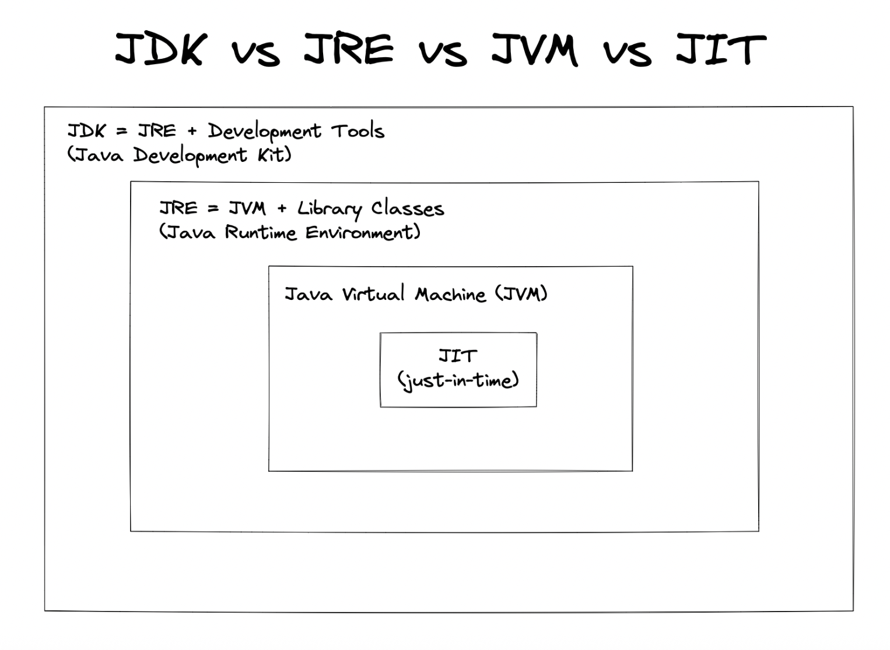
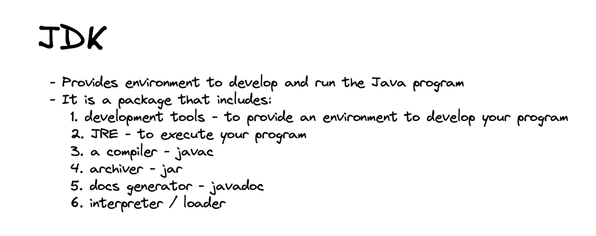
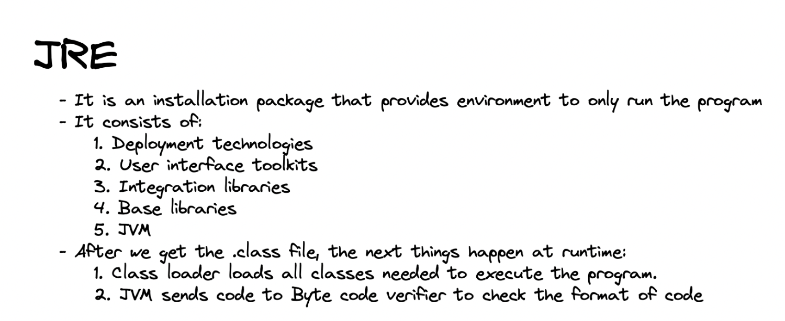

## Why Programming Languages?

- **Machine language** is hard for humans to read/write.
- **Programming languages** like Java allow writing instructions in a human-friendly, structured way.

## Java Code Execution: Step-by-Step

1. **Write Source Code (.java file)**
    - Code is human-readable and saved with a `.java` extension.
2. **Compilation (.class file / Bytecode)**
    - Java Compiler (`javac`) converts `.java` file to `.class` file containing **bytecode**.[^4][^6][^1]
    - Bytecode is **platform-independent** (can run on any OS).[^6][^1]
3. **Class Loader \& JVM Execution**
    - The Java Virtual Machine (**JVM**) loads `.class` files.
    - **JVM** interprets (and may just-in-time compile) bytecode to machine code for the specific OS.
    - The **main()** method is required as program entry point.[^5][^4]

***

## Why Java is Platform Independent?

- Bytecode runs on any system with a suitable JVM installed.
- The JVM is implemented for each OS, making Java programs ‘write once, run anywhere’.[^5][^1]

***

## Components of Java Architecture

- **JDK (Java Development Kit):**
    - Contains compiler, debugger, documentation and development tools.
    - **Includes JRE.**

- **JRE (Java Runtime Environment):**
    - Contains JVM and libraries needed to run Java programs.
    - Does NOT include development tools.

- **JVM (Java Virtual Machine):**
    - Runs bytecode, handles memory, security, garbage collection.
    - Platform-dependent component, but runs platform-independent bytecode.[^3][^5]

***

## Important Java Terms

- **Compile Time:** The process when source code is converted to bytecode; errors are caught here.
- **Runtime:** When the program runs on JVM; runtime errors may occur.
- **Class Loader:** Loads classes into JVM memory during execution.[^6][^1][^5]

***

## Working of JVM: Execution Flow

1. **Class Loading:** Finds and loads required `.class` files.
2. **Bytecode Verification:** Checks code safety and validity.
3. **Execution:** Uses an interpreter and Just-In-Time (JIT) compiler for optimal speed.
4. **Memory Management:** Handles allocation, deallocation, garbage collection.[^5]

***

## Java Program Flow

1. **Edit/Write Code:** Using any text editor or IDE.
2. **Compile:** Using `javac filename.java` to generate `filename.class`.
3. **Run:** Using `java ClassName` to execute with JVM.

***

## Installing Java Tools

- **JDK download:** https://www.oracle.com/java/technologies/javase-downloads.html
- **IDE suggestion:** IntelliJ IDEA (for coding).
- **Replit:** Online option for quick Java programming ().[^1]

***

## Recap Table: Java Development Steps

| Stage | Tool/Component | File/Output | Purpose |
| :-- | :-- | :-- | :-- |
| Coding | Editor/IDE | `.java` (source code) | Write human-readable code |
| Compilation | javac | `.class` (bytecode) | Translate to platform-independent |
| Execution | JVM/JRE | Machine instructions | Run on any OS with JVM |

***

## Key Takeaways

- Java’s **architecture** separates writing, compiling, and running code.
- Platform independence comes from compiling to bytecode and running on JVM.
- JDK is required for development; JRE for running Java apps.
- JVM handles execution and abstraction from specific hardware/platforms.[^3][^1][^5]